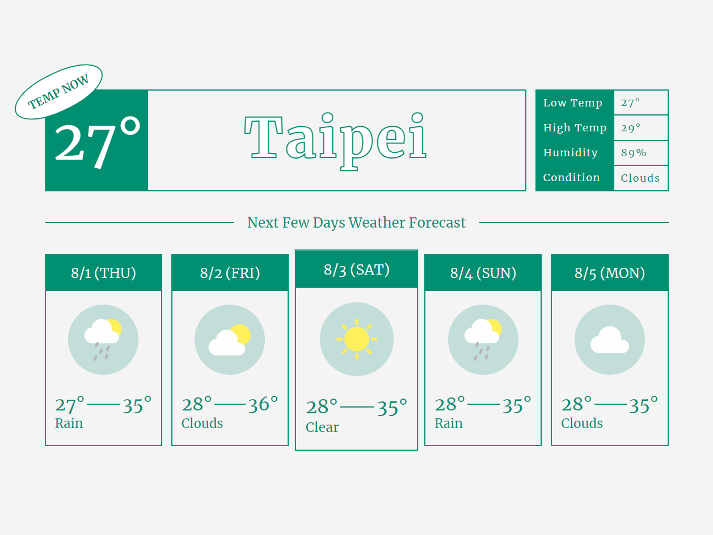
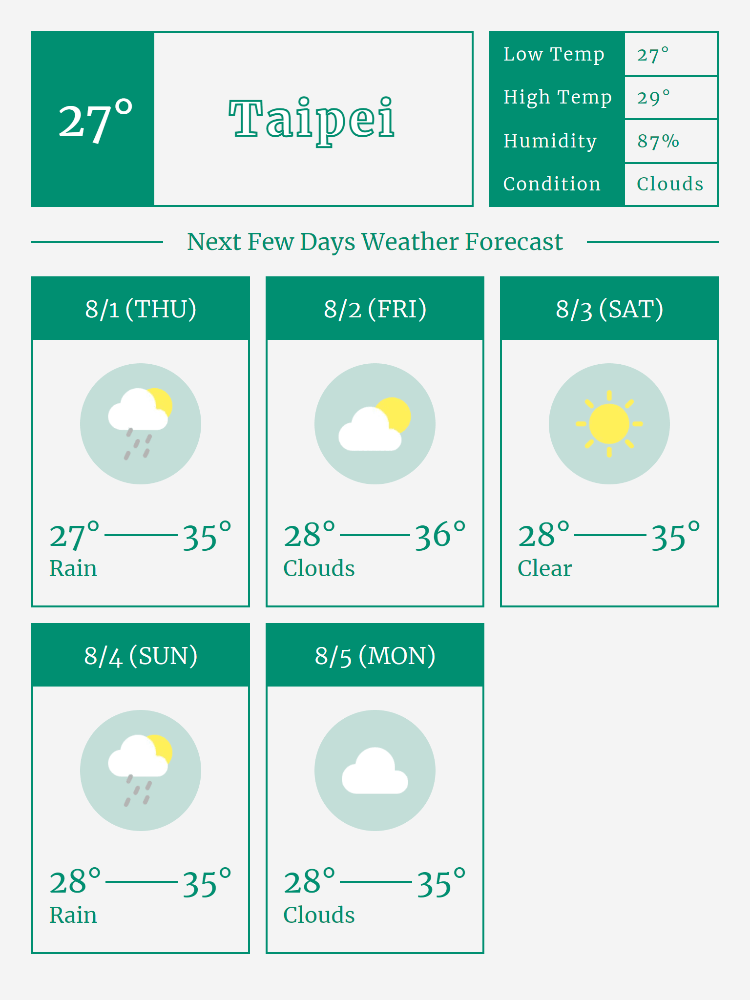
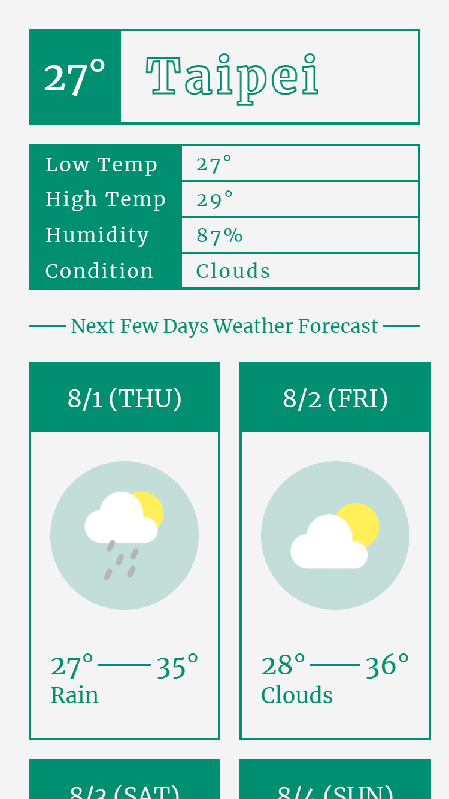

# React Weather Demo

一個天氣預報頁面，用 Figma 設計了簡單的版面，串接 OpenWeather API 中的 Current weather data 以及 5 day weather forecast 兩支 api 的資料

## Features

- 查看當下天氣
- 查看未來幾天的天氣

## Technologies

- JSX
- CSS
- JavaScript
- React
- Next.js
- OpenWeather API

## Preview

  
  
  

